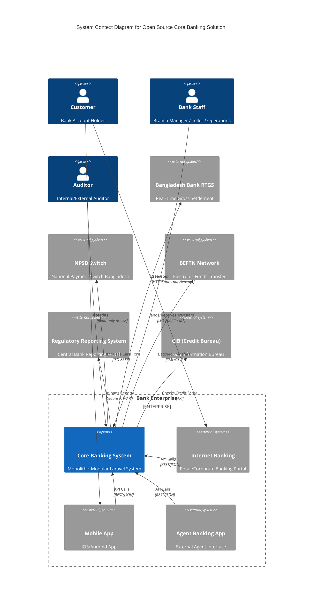

# System Context Diagram - Open Source Core Banking Solution

This diagram depicts the high-level context of the Core Banking System (CBS) and its interactions with external actors and systems.

## Actors
1.  **Customer**: Uses digital channels to interact with the bank.
2.  **Bank Staff**: Uses the internal CBS UI to perform operations.
3.  **Auditor**: Inspects logs and reports for compliance.

## External Systems
1.  **National Payment Switches (RTGS, NPSB, BEFTN)**: Required for inter-bank connectivity.
2.  **Regulatory Body (Bangladesh Bank)**: Receives mandatory compliance reports.
3.  **Credit Bureau**: Source of truth for creditworthiness.
